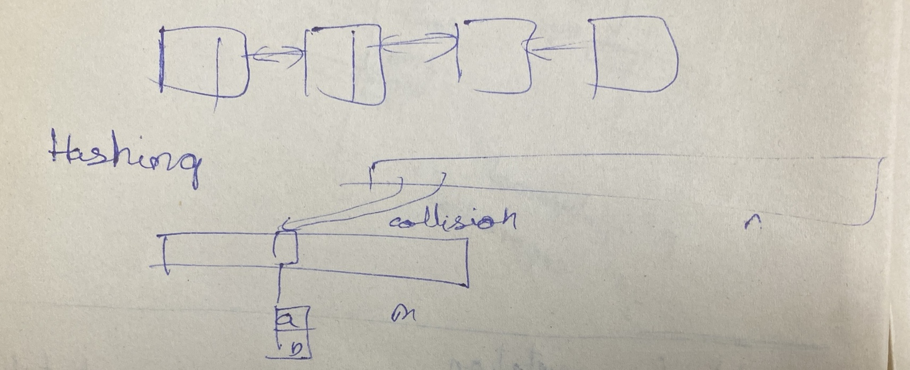
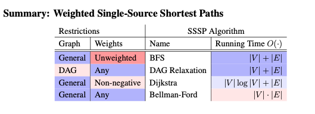

## Lecture 1

Order of increasing asymptotic complexity

| Shorthand | Constant | Logarithmic | Linear | Quadratic | Polynomial | Exponential |
| --- | --- | --- | --- | --- | --- | --- |
| Θ(f(n)) | Θ(1) | Θ(log n) | Θ(n) | Θ(n^2) | Θ(n^c) | 2^Θ(n^c) |

In order to precisely calculate the resources used by an algorithm, we need to model how long a computer takes to perform basic operations. Specifying such a set of operations provides a model of computation upon which we can base our analysis. In this class, we will use the w-bit Word- RAM model of computation, which models a computer as a random access array of machine words called memory, together with a processor that can perform operations on the memory.

If a machine word contains only w bits, the processor will only be able to read and write from at most 2w addresses in memory2. So when solving a problem on an input stored in n machine words, we will always assume our Word-RAM has a word size of at least w > log2 n bits, or else the machine would not be able to access all of the input in memory.

We moved from 32 to 64 bit as 32 bit limited ram memory to 4gb

### Data Structure

A data structure is a way to store a non-constant amount of data, supporting a set of operations to interact with that data. The set of operations supported by a data structure is called an interface. Many data structures might support the same interface, but could provide different performance for each operation.

## Lecture 2

### Sequence Interface (L02, L07)

Sequences maintain a collection of items in an **extrinsic order**, where each item stored has a rank in the sequence, including a **first item** and a **last item**. By extrinsic, we mean that the first item is ‘first’, not because of what the item is, but because some external party put it there.

Sequences are generalizations of **stacks** and **queues**, which support a subset of sequence operations.

#### Sequence Operations

| **Container**     | **Static**                                              | **Dynamic** |
| ----------------- | ------------------------------------------------------- | ----------- |
| `build(X)`        | Given an iterable `X`, build sequence from items in `X` |
| `len()`           | Return the number of stored items                       |
| `iter_seq()`      | Return the stored items one-by-one in sequence order    |
| `get_at(i)`       | Return the `i`-th item                                  |
| `set_at(i, x)`    | Replace the `i`-th item with `x`                        |
| `insert_at(i, x)` | Add `x` as the `i`-th item                              |
| `delete_at(i)`    | Remove and return the `i`-th item                       |
| `insert_first(x)` | Add `x` as the first item                               |
| `delete_first()`  | Remove and return the first item                        |
| `insert_last(x)`  | Add `x` as the last item                                |
| `delete_last()`   | Remove and return the last item                         |

> **Note:** Insert/delete operations change the rank of all items after the modified item.

---

### Set Interface (L03-L08)

By contrast, **Sets** maintain a collection of items based on an **intrinsic property** involving what the items are, usually based on a **unique key** `x.key`, associated with each item `x`.

Sets are generalizations of **dictionaries** and other intrinsic query databases.

#### Set Operations

| **Category** | **Operations**                                                                    |
| ------------ | --------------------------------------------------------------------------------- |
| **General**  | `build(X)`: Given an iterable `X`, build set from items in `X`                    |
|              | `len()`: Return the number of stored items                                        |
| **Static**   | `find(k)`: Return the stored item with key `k`                                    |
| **Dynamic**  | `insert(x)`: Add `x` to set (replace item with key `x.key` if one already exists) |
|              | `delete(k)`: Remove and return the stored item with key `k`                       |
| **Order**    | `iter_ord()`: Return the stored items one-by-one in key order                     |
|              | `find_min()`: Return the stored item with the smallest key                        |
|              | `find_max()`: Return the stored item with the largest key                         |
|              | `find_next(k)`: Return the stored item with the smallest key larger than `k`      |
|              | `find_prev(k)`: Return the stored item with the largest key smaller than `k`      |

> **Note:** `find` operations return `None` if no qualifying item exists.

---

#### Worst-Case Complexity Table for Some Sequence Data Structures

<table>
  <tr>
    <th rowspan="2">Data Structure</th>
    <th colspan="1">
    <th colspan="1">Static Operations</th>
    <th colspan="3">Dynamic Operations</th>
  </tr>
  <tr>
    <th>build(X)</th>
    <th>get_at(i), set_at(i, x)</th>
    <th>insert_first(x), delete_first()</th>
    <th>insert_last(x), delete_last()</th>
    <th>insert_at(i, x), delete_at(i)</th>
  </tr>
  <tr>
    <td>Array</td>
    <td>O(n)</td>
    <td>O(1)</td>
    <td>O(n)</td>
    <td>O(n)</td>
    <td>O(n)</td>
  </tr>
  <tr>
    <td>Linked List</td>
    <td>O(n)</td>
    <td>O(n)</td>
    <td>O(1)</td>
    <td>O(n)</td>
    <td>O(n)</td>
  </tr>
  <tr>
    <td>Dynamic Array</td>
    <td>O(n)</td>
    <td>O(1)</td>
    <td>O(1)</td>
    <td>O(1) (amortized)</td>
    <td>O(n)</td>
  </tr>
</table>

## Lecture 3

- Storing items in a array in arbitary order can implement a (not so efficient) set
- Stored items sorted increasing by key allows:
  - faster find min/max(at first and last index of array)
  - faster finds via binary search: O(log n)

<table>
<tr>
    <th rowspan = "3"> Set Data Structure</th>
    <th> Container</th>
    <th> Static</th>
    <th> Dynamic</th>
    <th colspan = "2"> Order</th>
</tr>
<tr>
    <th rowspan ="2">build(X)</th>
    <th rowspan ="2">find(k)</th>
    <th> insert(X) </th>
    <th> find_min() </th>
    <th> find_prev(k) </th>
</tr>
<tr>
    <th> delete(k) </th>
    <th> find_max() </th>
    <th> find_next(k) </th>
</tr>
<tr>
    <td>Array</td>
    <td>O(n)</td>
    <td>O(n)</td>
    <td>O(n)</td>
    <td>O(n)</td>
    <td>O(n)</td>
</tr>
<tr>
    <td>Sorted Array</td>
    <td>O(nlogn) </td>
    <td> O(log n) </td>
    <td> O(n) </td>
    <td> O(1) </td>
    <td> O(log n) </td>
</tr>
</table>

### Sorting

- A sort is destructive if it overwrites A (instead of making a new array B)
  - Also called inplace as it uses only O(1) extra space
- Permutaion Sort
  - compute all permutaions and check if they are sorted O(n!n)
- Selection Sort
  - Find largest number in A[:i+1] and swap it to A[:i] - O(n2)
- Insertion Sort
  - Recursively sort A[:i] - O(n2)
- Merge Sort
  - Recursively sort first half and second half - O(nlogn)
  - This is not inplace uses O(n) extra space

## Lecture 4

<table>
<tr>
    <th rowspan = "3">Data Structure</th>
    <th> Container</th>
    <th> Static</th>
    <th> Dynamic</th>
    <th colspan = "2"> Order</th>
</tr>
<tr>
    <th rowspan ="2">build(X)</th>
    <th rowspan ="2">find(k)</th>
    <th> insert(X) </th>
    <th> find_min() </th>
    <th> find_prev(k) </th>
</tr>
<tr>
    <th> delete(k) </th>
    <th> find_max() </th>
    <th> find_next(k) </th>
</tr>
<tr>
    <td>Array</td>
    <td>O(n)</td>
    <td>O(n)</td>
    <td>O(n)</td>
    <td>O(n)</td>
    <td>O(n)</td>
</tr>
<tr>
    <td>Sorted Array</td>
    <td>O(nlogn) </td>
    <td> O(log n) </td>
    <td> O(n) </td>
    <td> O(1) </td>
    <td> O(log n) </td>
</tr>

<tr>
    <td>Direct Access Array</td>
    <td>u </td>
    <td> 1 </td>
    <td> 1 </td>
    <td> u </td>
    <td> u </td>
</tr>
<tr>
    <td>Direct Access Array</td>
    <td>n(e) </td>
    <td> 1(e) </td>
    <td> 1(a)(e) </td>
    <td> u </td>
    <td> u </td>
</tr>
</table>

### Hash functions

1. Division hash function(bad): h(k)=k(mod m)
   - Good when keya are uniformly distributed
   - m should avoid symmetries of keys
   - Idea: Don't use a fixed hash function!
2. Universal

- Hash Family H(p, m) = {hab | a, b ∈ {0, . . . , p - 1} and a ≠ 0}
- Parameterized by a fixed prime p > u, with a and b chosen from range {0, . . . , p - 1}
- H is a Universal family: Pr {h(ki) = h(kj)} ≤ 1/m ∀ki ≠ kj ∈ {0, . . . , u - 1} h∈H
- Why is universality useful? Implies short chain lengths! (in expectation)
- Xij indicator random variable over h∈H: Xij = 1 if h(ki) = h(kj), Xij = 0 otherwise

- Expected size of chain at index $h(k_i)$:  
  $E \{X_i\} = E \left[\sum_j X_{ij} \right]$  
   $= \sum_j E \{X_{ij}\}$  
   $= 1 + \sum_{j \neq i} E \{X_{ij}\}$  
   $= 1 + \sum_{j \neq i} \left[ (1) \Pr \{h(k_i) = h(k_j)\} + (0) \Pr \{h(k_i) \neq h(k_j)\} \right]$  
   $\leq 1 + \sum_{j \neq i} \frac{1}{m}$  
   $= 1 + \frac{n - 1}{m}$

- Since m = Ω(n), load factor α = n / m = O(1), so O(1) in expectation!

## Lecture 5

- Direct Access Array sort - O(n+u)
- Counting sort, same as above, uses direct access array but allows duplicate keys using chaining - O(n+u)
- Tuple sort - sort tuples by each of the keys least important first
- Radix sort
  - break each integer up into its multiples of powers of n, representing each item key its sequence of digits when represented in base n.
  - If the integers are non-negative and the largest integer in the set is u, then this base n number will have $log_nu$ digits. We can think of these digit representations as tuples and sort them with tuple sort by sorting on each digit in order from least significant to most significant digit using counting sort. This combination of tuple sort and counting sort is called radix sort.
  - If the largest integer in the set u ≤ nc, then radix sort runs in O(nc) time. Thus, if c is constant, then radix sort also runs in linear time!
  - Can't be used in every case for example in floating point numbers we can have an infinite number of digits ex- 3.1415........

## Lecture 6

### Binary tree

Height and depth are measured by nuber of edges to leaf and root respectively

<table>
<tr>
    <th rowspan = "3">Set Data Structure</th>
    <th> Container</th>
    <th> Static</th>
    <th> Dynamic</th>
    <th colspan = "2"> Order</th>
</tr>
<tr>
    <th rowspan ="2">build(X)</th>
    <th rowspan ="2">find(k)</th>
    <th> insert(X) </th>
    <th> find_min() </th>
    <th> find_prev(k) </th>
</tr>
<tr>
    <th> delete(k) </th>
    <th> find_max() </th>
    <th> find_next(k) </th>
</tr>
<tr>
    <td>Binary Tree</td>
    <td>n log n</td>
    <td>h</td>
    <td>h</td>
    <td>h</td>
    <td>h</td>
</tr>
</table>

<table>
<tr>
    <th rowspan = "3">Sequence
     Data Structure</th>
    <th> Container</th>
    <th> Static</th>
    <th> Dynamic</th>
    <th colspan = "2"> Order</th>
</tr>
<tr>
    <th rowspan ="2">build(X)</th>
    <th rowspan ="2">find(k)</th>
    <th> insert(X) </th>
    <th> find_min() </th>
    <th> find_prev(k) </th>
</tr>
<tr>
    <th> delete(k) </th>
    <th> find_max() </th>
    <th> find_next(k) </th>
</tr>
<tr>
    <td>Binary Tree</td>
    <td>n log n</td>
    <td>h</td>
    <td>h</td>
    <td>h</td>
    <td>h</td>
</tr>
</table>

- Augument each node with size of subtree to find ith node in traversal order in O(h) time else it will take O(n) time
- Naively, build(X) takes O(nh) time, but can be done in O(n) time; see recitation as the elements are already in the order they need to be. In set binary tree we would have to sort them first by key if we want traversal order
- Goal keep binary tree balanced to reduce O(h) to O(logn)

## Lecture 7

### AVL TRee

It is a balancing scheme which uses rotations to keep the binary tree balanced  
If tree is always balanced u becomes log n

<table>
<tr>
    <th rowspan = "3">Set Data Structure</th>
    <th> Container</th>
    <th> Static</th>
    <th> Dynamic</th>
    <th colspan = "2"> Order</th>
</tr>
<tr>
    <th rowspan ="2">build(X)</th>
    <th rowspan ="2">find(k)</th>
    <th> insert(X) </th>
    <th> find_min() </th>
    <th> find_prev(k) </th>
</tr>
<tr>
    <th> delete(k) </th>
    <th> find_max() </th>
    <th> find_next(k) </th>
</tr>
<tr>
    <td>AVL Tree</td>
    <td>n log n</td>
    <td>log n</td>
    <td>log n</td>
    <td>log n</td>
    <td>log n</td>
</tr>
</table>

<table>
<tr>
    <th rowspan = "3">Sequence
     Data Structure</th>
    <th> Container</th>
    <th> Static</th>
    <th> Dynamic</th>
    <th colspan = "2"> Order</th>
</tr>
<tr>
    <th rowspan ="2">build(X)</th>
    <th rowspan ="2">find(k)</th>
    <th> insert(X) </th>
    <th> find_min() </th>
    <th> find_prev(k) </th>
</tr>
<tr>
    <th> delete(k) </th>
    <th> find_max() </th>
    <th> find_next(k) </th>
</tr>
<tr>
    <td>AVL Tree</td>
    <td>n log n</td>
    <td>log n</td>
    <td>log n</td>
    <td>log n</td>
    <td>log n</td>
</tr>
</table>

## Lecture 8

### Priority queue interface

- Keep track of many items, quickly access/remove the most important
  - Example: router with limited bandwidth, must prioritize certain kinds of messages
  - Example: process scheduling in operating system kernels
  - Example: discrete-event simulation (when is next occurring event?)
  - Example: graph algorithms (later in the course)
- Order items by key = priority so Set interface (not Sequence interface)
- Optimized for a particular subset of Set operations: - build(X) build priority queue from iterable X - insert(x) add item x to data structure - delete max() remove and return stored item with largest key
  find max() return stored item with largest key
- (Usually optimized for max or min, not both)
- Focus on insert and delete max operations: build can repeatedly insert;
  find max() can insert(delete min())

#### Priority Queue Sort

- Any priority queue data structure translates into a sorting algorithm:
  - build(A), e.g., insert items one by one in input order
  - Repeatedly delete min() (or delete max()) to determine (reverse) sorted order
- All the hard work happens inside the data structure
- Running time is $T*{build} + n \cdot T*{delete_max} \leq n\cdot T*{insert} +n \cdot T*{delele_max} $
- Many sorting algorithms we’ve seen can be viewed as priority queue sort:
  

We use heaps to achieve this goal

## Lecture 9

Common graph terminology like vertices, edges, directed, undirected, out/in degree of vertex.

Adjacency lists are used to store graphs efficiently.

### Breadth-First Search

We know that graphs are used everywhere to store data so we need some methods of exploring them.

BFS gives level order traversal of graph
We also use bfs to get single source shortest paths(SSSP) in unweighted graphs.

O(V+E) time traversal

## Lecture 10

### Deapth-First Search

DFS doesn't give SSSP but we can still find reachability of vertices and traversal order.

DFS seems to be more widely used than BFS for traversal order as it can give preorder, inorder and postorder traversal and is also easier to implement recursively.

DFS is also used for cycle detection and to get a topological ordering for DAGs.

Topological sorting for Directed Acyclic Graph (DAG) is a linear ordering of vertices such that for every directed edge u-v, vertex u comes before v in the ordering.

Note: Topological Sorting for a graph is not possible if the graph is not a DAG.

Most commonly the ordering is the reverse order in which DFS finishes visiting the vertices

BFS can also give topological sort and cycle detection although it is less widely used.

## Lecture 11

SSSP for DAGs using DAG relaxation i.e. relax edges according to topological order.

Relaxation is the key concept in finding shortest paths for any algorithm.

## Lecture 12

Bellman Ford algorithm which finds SSSP for any general graph.

## Lecture 13

Dijkstra's algorithm, finds SSSP for general graph with non negative weights. Similar to dag relaxation but instead of processing in topological order we just process the lowest distance first and remove that vertex using priority queue.

## Lecture 15

### SRTBOT framework

How to solve a problem recursively (SRT BOT)

1. Subproblem definition
2. Relate subproblem solutions recursively
3. Topological order on subproblems (⇒ subproblem DAG)
4. Base cases of relation
5. Original problem solution via subproblem(s)
6. Time analysis

## Lecture 16

if you cant figure out exact subproblem try adding constraints or increasing the space of problems

if you need both prefix and suffix in a subproblem you probably need substrings
dp seems to bring exponential time down to polynomial time for example in the arithmetic parentheses brute force would be 2^n but it is brought down to n^3
